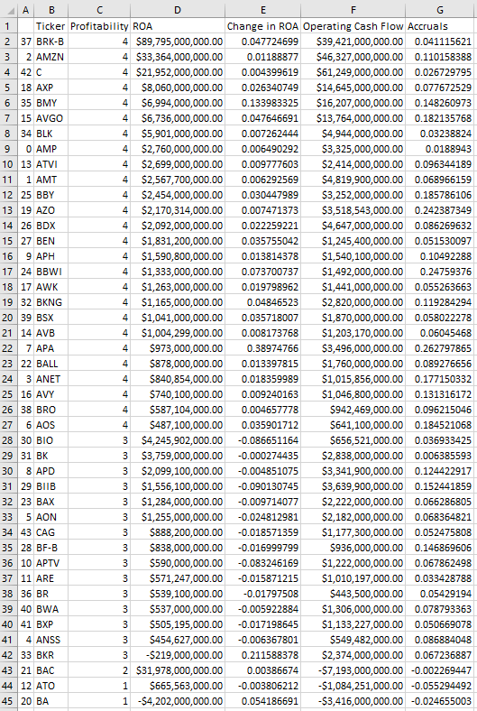

# profitalyze (profit-analyze)

Collects stock data from the Yahoo Finance API to extract ROA/Operating Cashflow and analyzes a profit score (profitalyze!) based on financial data extrapolation

Sample data:

